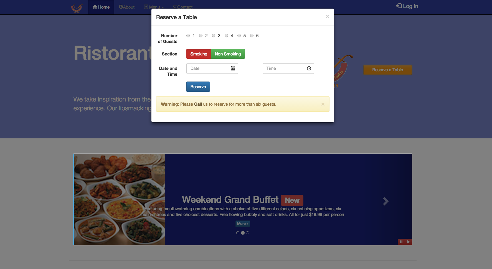
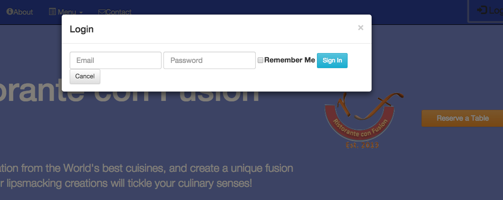

# conFusion
This is the working example for week 1 of the second course in the coursera full
stack web development course.
conFusion is the name of a hypothetical restaurant and the project is to make a
responsive web page.

Screen shot of week 1 assignment. Modified the webpage to include breadcrumbs,
utilized row-content and columns. Added home links to all the home buttons and
the Ristorante Con Fusion text in the navbar.

[//]: # (Comment) 
<figure></figure>

##Assignment 4 - Using Javascript instead of data-* attributes
According to W3schools.com, data-* attributes are attributes of HTML that:

The data-* attributes is used to store custom data private to the page or application.

The data-* attributes gives us the ability to embed custom data attributes on all HTML elements.

Bootstrap has used these attributes and developed advanced capability in
providing functionality to buttons and links among other things.  In Assignment
3 we developed Modal popups for both the Reserve Table function as well as the
Log In function for the the index web Page for the conFusion Restaurant. In This
assignment I provide the same functionality with the use of Javascript alone.
###The index page

[//]: # (Comment) 
<figure></figure>
###The Reserve Table Modal functionality
[//]: # (Comment) 
<figure></figure>
###The Log In Modal functionality
[//]: # (Comment) 
<figure></figure>
